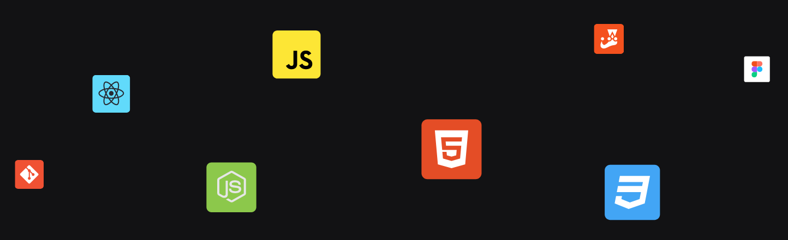

# Programa Explorer da @Rocketseat - Desenvolvimento FullStack

## 📢 Sobre o Programa Explorer

**Programa baseado no método 7-2-1 (70% coding, 20% networking, 10% branding). O Explorer contém o conteúdo para desenvolver habilidades técnicas e comportamentais, iniciar uma carreira sólida na programação e se tornar um dev destaque.**

## 🗒️ Conteúdo Programático

**Introdução à programação web**:

> Fundamentos da internet; Protocolos; Navegadores; Cliente & servidor; Front-end & Back-end;

**HTML**:

> Configuração de IDE; Ferramentas dev do navegador; Fundamentos do HTML; Tags & atributos; Semântica; Formulários; Mídias;

**CSS**:

> Fundamentos do CSS; Box Model; Flex Layout; Grid Layout; Position; Responsividade; Transformações; Animações e transições; Interpretação de layouts (Figma);

**Lógica de programação**:

> Entendendo problemas; Algoritmos; Paradigmas de programação;

**JavaScript**:

> Fundamentos do JavaScript; Estruturas de dados; Funções; Controles de fluxo; Estruturas de repetição; Expressões e operadores; JavaScript assíncrono; Tratativa de erros; Syntax Sugars; ES Modules; DOM; Web APIs; Manipulação de vetores;

**Encontrando soluções**:

> Forums; Como pesquisar?; Como identificar erros?; Fontes de pesquisa;

**Git & GitHub**:

> Controle de versão; Fundamentos do Git & GitHub;

**Back-end**:

> Fundamentos do back-end; Node.js; NPM (Gerenciador de pacotes); SQL; Criação de API's;

**Front-end**:

> Tipos de aplicações (SSR, SPA); Bibliotecas e frameworks; Transpilers & Bundlers; Pré-processadores CSS; Styled-components; React.js;

**API RESTful**:

> Consumo de API; Integração front-end e back-end; JSON; Autenticação; Testes;

**Deploy de projetos**:

> CI/CD; Digital Ocean; Heroku; Vercel; Netlify;

## 💻 Projetos

<table>
  <thead>
    <tr>
      <td>Repositório</td>
      <td>Deployment do Projeto</td>
    </tr>
  </thead>
  <tr>
    <td>
      <a href="Stage02-IntroHTML_CSS/MoveisCustomizados/" target="_blank">Stage 02 - Móveis Customizados</a>
    </td>
    <td>
      <a href="https://jeffersonvidal.github.io/Explorer-Rocketseat/Stage02-IntroHTML_CSS/MoveisCustomizados/" target="_blank">Ver Projeto Online</a>
    </td>
  </tr>
  <tr>
    <td>
      <a href="Stage02-IntroHTML_CSS/TreineMe/" target="_blank">Stage 02 - Treine-me</a>
    </td>
    <td>
      <a href="https://jeffersonvidal.github.io/Explorer-Rocketseat/Stage02-IntroHTML_CSS/TreineMe/" target="_blank">Ver Projeto Online</a>
    </td>
  </tr>
</table>

## 🛠 Tecnologias utilizadas/aprendidas

 

    
    
    
    
    
    
    
    

 

 

---

### Contato

### [**Jefferson Vidal**](https://github.com/jeffersonvidal)

🛠 Web Developer  
📍 Brasilia/DF - Brazil

&nbsp;&nbsp;&nbsp;

 
