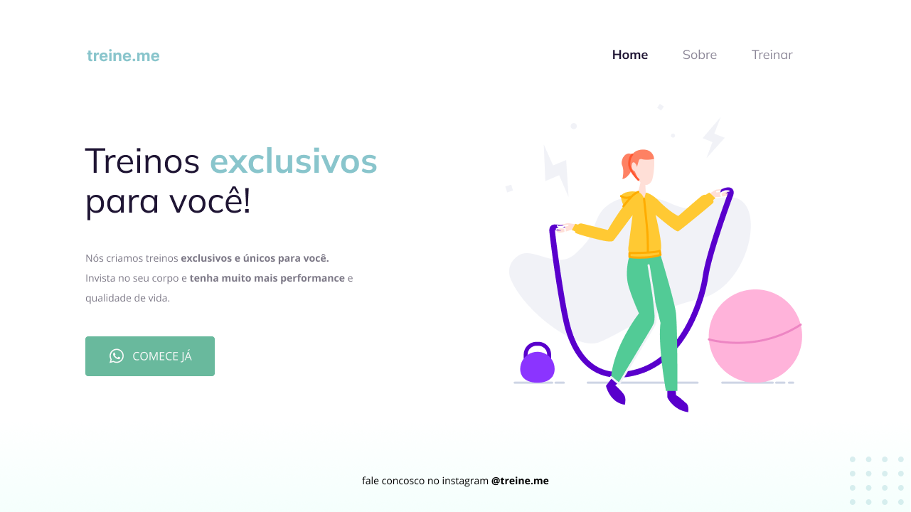

# Desafio 02 - Treine.me ✅

- <a href="https://jeffersonvidal.github.io/Explorer-Rocketseat/Stage02-IntroHTML_CSS/TreineMe/">Acesse aqui.</a>

## 💻 O desafio

Móveis custumizados é uma página web simples para uma empresa fictícia de venda de móveis. Nesse projeto aprendi um pouco sobre:

- Introdução ao HTML5: tags, atributos e etc;
- Introdução ao CSS3: seletores e propriedades;
- Figma básico;
- Box Model;
- Uso do <a href="https://fonts.google.com">Google Fonts</a>;
- Utilizar o Github para versionar, "hospedar" ou fazer deploy dos projetos de páginas simples.

## 🎨 Layout do projeto

Este é o <a href="https://www.figma.com/file/DbV4p4rBhWhWzzO6zY51Xp/Projeto-02---Explorer?type=design&node-id=23%3A1928&mode=dev">layout do projeto</a> no Figma.

## 🛠 Tecnologias

    
    

 

 

---

<table>
  <tr>
    <td>
      
    </td>
    <td>
      
    </td>
    <td>
      Feito por <a href="https://github.com/jeffersonvidal">Jefferson Vidal</a> 🙋🏿‍♂️
        Junto com <a href="https://rocketseat.com.br">Rocketseat</a> 🚀.
    </td>
  </tr>
</table>
